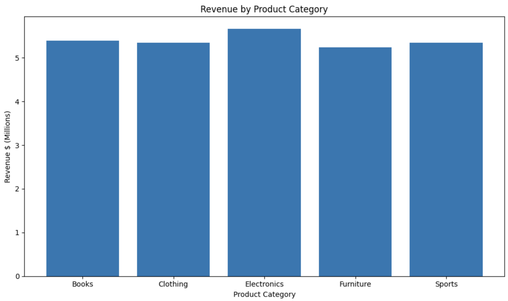
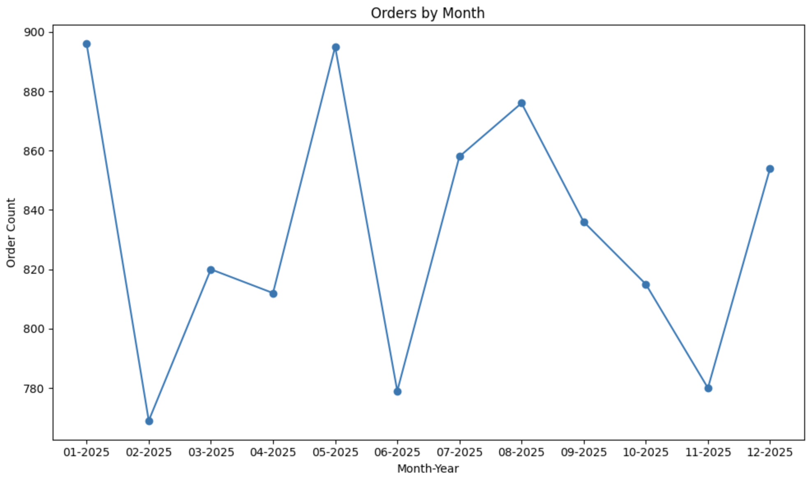
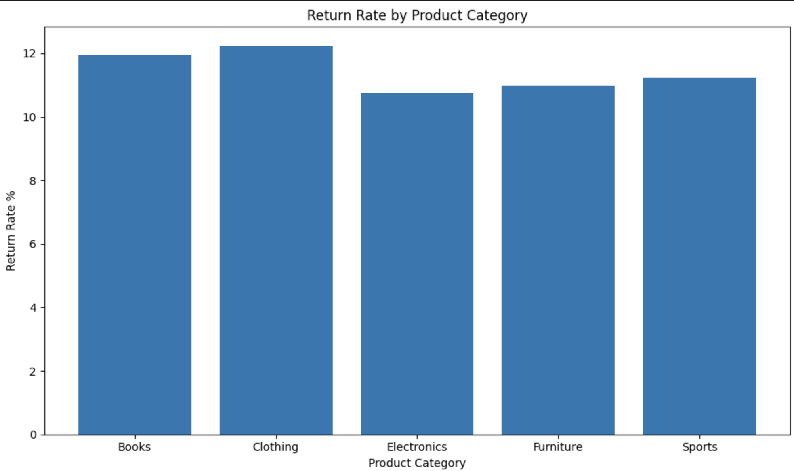

# Online Store Order Analysis

An end-to-end data analytics project using Python, Pandas, and Matplotlib to analyze customer purchasing behavior, revenue performance, and operational trends.

## Project Overview

This project analyzes a fictional online retail dataset to identify trends in revenue, customer behavior, product performance, return rates, and data quality issues.

The project follows a structured analytics workflow:

1. Data Understanding
2. Data Quality Assessment
3. Data Cleaning
4. Feature Engineering
5. Exploratory Analysis
6. Filtering Analysis
7. Aggregation Analysis
8. Customer Analysis
9. Data Visualization
10. Executive Summary

---

## Business Questions

This analysis aims to answer questions such as:

- Which states generate the most revenue?
- Which product categories perform best?
- Which categories experience the highest return rates?
- How do customers behave?
- Are there significant data quality issues?
- What impact do outliers have on business metrics?

---

## Dataset Overview

The dataset contains approximately:

- 10,000 orders
- 2,876 unique customers
- Order-level transaction information
- Product categories
- Shipping information
- Return indicators
- Customer identifiers

---

## Data Cleaning Highlights

Several data quality issues were identified and addressed:

- Removed 50 duplicate records
- Standardized state values
- Standardized product category values
- Corrected data types
- Investigated suspicious quantities and prices
- Evaluated extreme outlier orders

---

## Key Findings

### Business Performance

- Total Orders Analyzed: **9,990**
- Total Revenue (Outliers Removed): **$26.99M**
- Average Order Value: **$2,728**
- Average Shipping Time: **5.03 Days**
- Overall Return Rate: **11%**

### Revenue Performance

- Highest Revenue State: **Colorado ($3.51M)**
- Highest Revenue Category: **Electronics ($5.66M)**

### Customer Insights

- Unique Customers: **2,874**
- Average Customer Spend: **$2,726**

### Operational Insights

- Highest Return Rate Category: **Clothing (12.2%)**
- No strong relationship was identified between returns and discounts, shipping times, or payment status.

### Outlier Analysis

- 10 extreme orders accounted for approximately **94% of total revenue**
- These records materially distorted business metrics and were excluded from primary analysis.

---

## Visualizations

### Revenue by Product Category

This chart compares total revenue generated across product categories and highlights Electronics as the highest-performing category.



### Orders by Month

This chart shows monthly order volume throughout the year and helps identify seasonal patterns in customer purchasing activity.



### Return Rate by Product Category

This chart compares return rates across product categories and highlights operational areas that may require additional investigation.



---

## Tools Used

- Python
- Pandas
- NumPy
- Matplotlib
- Jupyter Notebook

---

## Project Structure

```text
project/
│
├── data/
├── notebooks/
│   └── online_store_analysis.ipynb
├── images/
│   ├── orders_by_month.png
│   ├── return_rate_by_product_category.png
│   └── revenue_by_product_category.png
├── README.md
```

---

## Skills Demonstrated

- Data cleaning and validation
- Feature engineering
- Exploratory data analysis
- Grouped aggregations
- Business-focused analysis
- Data visualization
- Executive-level communication of findings